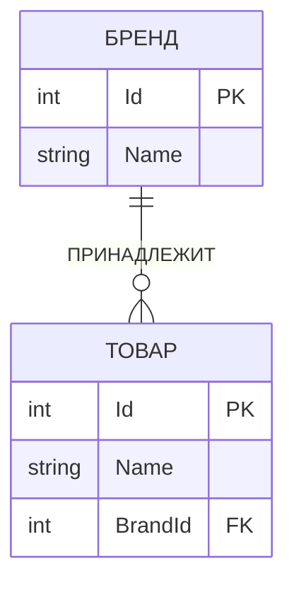
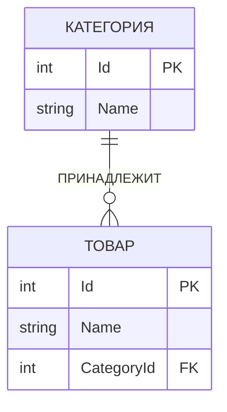
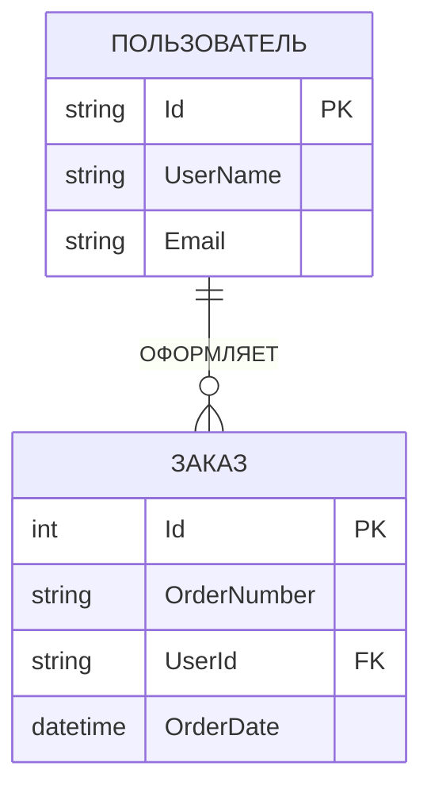
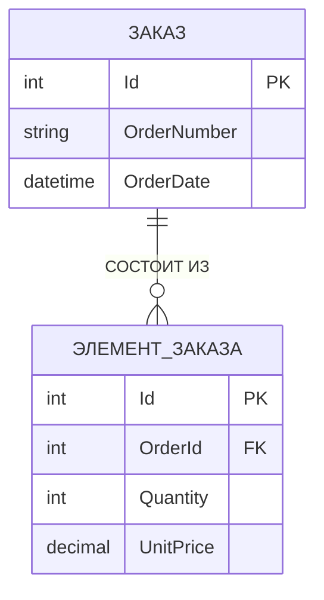
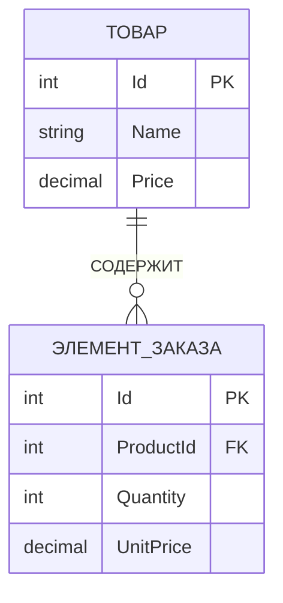
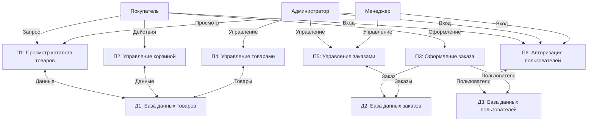

МИНИСТЕРСТВО НАУКИ И ВЫСШЕГО ОБРАЗОВАНИЯ

РОССИЙСКОЙ ФЕДЕРАЦИИ

Федеральное государственное бюджетное образовательное

учреждение высшего образования

«Чувашский государственный университет имени И.Н. Ульянова»

Факультет информатики и вычислительной техники

Кафедра компьютерных технологий

КУРСОВОЙ ПРОЕКТ

по дисциплине «ПРОГРАММИРОВАНИЕ НА ЯЗЫКАХ ВЫСОКОГО УРОВНЯ»

на тему «Разработка онлайн-магазина по продаже брендовой одежды»

Выполнил: студент

группы ЗКТ-44-22

Михайлов Данила Алексеевич

Проверил: доцент кафедры компьютерных технологий, к.ф.-м.н.

Тихонов Сергей Владимирович

Чебоксары, 2025

---

# СОДЕРЖАНИЕ

ВВЕДЕНИЕ ………………………………………………………………. 3

**ГЛАВА 1. Проектирование структуры веб-приложения** …………… 4

1.1. Анализ предметной области ………………………………………. 4

1.2. Концептуальное проектирование …………………………………. 11

1.3. Логическое проектирование ……………………………………… 14

1.4. Физическое проектирование ……………………………………… 19

**ГЛАВА 2. Описание функционирования веб-приложения** ………… 25

2.1. Назначение и перечень функций веб-приложения ……………… 25

2.2. Программная реализация веб-приложения ……………………… 26

ЗАКЛЮЧЕНИЕ …………………………………………………………… 52

СПИСОК ИСПОЛЬЗУЕМЫХ ИСТОЧНИКОВ ………………………… 53

---

# ВВЕДЕНИЕ

Объектом исследования курсового проекта является веб-приложение для автоматизации процессов продажи брендовой одежды через интернет-магазин.

Целью курсового проекта является разработка веб-приложения онлайн-магазина по продаже брендовой одежды на базе технологий ASP.NET Core Blazor Server.

Данная тема актуальна, так как в настоящее время интернет-торговля является одним из наиболее быстро развивающихся сегментов экономики. Рост популярности онлайн-покупок связан с удобством выбора товаров, возможностью сравнения цен, экономией времени и доступностью товаров независимо от географического расположения покупателя. Особенно это актуально для сферы продажи брендовой одежды, где покупателям важно иметь доступ к широкому ассортименту товаров от различных производителей, возможность фильтрации по брендам, категориям, размерам и ценам. Автоматизация процессов управления товарами, заказами и пользователями значительно повышает эффективность работы магазина и улучшает качество обслуживания клиентов [1].

Задачи курсового проекта:

1. Провести анализ предметной области, выполнить концептуальное, логическое и физическое проектирование веб-приложения онлайн-магазина по продаже брендовой одежды.

2. Разработать программу для автоматизации работы интернет-магазина с функциями каталога товаров, корзины покупок, системы заказов, авторизации пользователей и управления контентом.

---

# ГЛАВА 1. Проектирование структуры веб-приложения

## 1.1. Анализ предметной области

Поиск и изучение информации о потребностях заказчика, а также выяснение смысла данной информации для дальнейшей работы с проектом, называется анализом предметной области. Анализ предметной области – это первая фаза проектирования предметной области [2].

В качестве предметной области в данной курсовой работе рассматривается деятельность интернет-магазина по продаже брендовой одежды.

Выбор данной области был связан с потребностями рынка. С ростом объема информации обусловлено увеличение объема продаж, усложнение структуры ассортимента, необходимость управления большим количеством товарных позиций от различных брендов.

Каждому интернет-магазину нужен спрос на предоставляемые товары, поэтому в настоящий момент недостаточно просто продавать товар, чтобы удержаться на рынке. Сейчас важным фактором предприятия является современный веб-сайт с удобным интерфейсом для покупателей, предоставляющий возможность быстрого поиска нужных товаров, фильтрации по различным параметрам, оформления заказов и управления личным кабинетом. Также необходима административная панель для управления товарами, заказами и пользователями.

Реализация таких решений даёт возможность магазину увеличить покупательский спрос, прибыль и сэкономить время как клиентов, так и персонала магазина. Поэтому интернет-магазин брендовой одежды должен выполнять следующие основные функции:

- управление продажами (каталог товаров, корзина покупок, оформление заказов);
- управление товарным ассортиментом (добавление, редактирование, удаление товаров, брендов, категорий);
- управление заказами (просмотр, изменение статусов, обработка заказов);
- управление пользователями и кадровый учет (регистрация, авторизация, роли, личные кабинеты);
- информационная (обеспечение клиентов информацией о товарах, брендах, доступности).

Данные функции реализуются в большинстве современных интернет-магазинов.

В настоящее время существует множество готовых решений для создания интернет-магазинов. Рассмотрим несколько примеров успешных интернет-магазинов брендовой одежды.

Одним из популярных примеров является сайт «Wildberries» (https://www.wildberries.ru/). Данный интернет-магазин предоставляет широкий ассортимент товаров различных категорий, включая брендовую одежду. На сайте реализованы функции каталога с фильтрацией по различным параметрам, корзины покупок, личного кабинета пользователя, отслеживания заказов. Административная панель позволяет управлять товарами, ценами, акциями и заказами.

Другим примером является сайт «Lamoda» (https://www.lamoda.ru/). Этот интернет-магазин специализируется на продаже модной одежды и обуви. На сайте реализованы функции каталога товаров с детальными описаниями, изображениями, размерами, фильтрации по брендам, категориям, размерам, цветам и ценам, корзины покупок, оформления заказов с выбором способа доставки, системы скидок и акций, личного кабинета с историей заказов.

Также можно рассмотреть интернет-магазин «Brandshop» (https://brandshop.ru/), который специализируется на продаже брендовой одежды и обуви. На сайте реализованы функции каталога с подробными карточками товаров, фильтрации по брендам и категориям, корзины покупок, системы авторизации и регистрации, управления заказами, программы лояльности.

При сравнении рассмотренных интернет-магазинов было выявлено, что все они имеют схожий функционал: каталог товаров с фильтрацией, корзину покупок, систему заказов, авторизацию пользователей. Основные отличия заключаются в дизайне интерфейса, дополнительных функциях (например, программа лояльности, системы рекомендаций) и масштабе ассортимента.

На основе проведённого анализа предметной области был выделен перечень функций, которые будут реализованы в курсовом проекте:

1. Каталог товаров с фильтрацией по брендам, категориям и поиском по названию.
2. Детальный просмотр информации о товаре.
3. Корзина покупок с возможностью изменения количества товаров.
4. Оформление заказов с указанием адреса доставки.
5. Система авторизации и регистрации пользователей с дополнительными полями (пол, дата рождения, предпочитаемый размер, город).
6. Система ролей и разграничение прав доступа (Администратор, Менеджер, Покупатель).
7. Административная панель для управления товарами (CRUD-операции).
8. Административная панель для управления брендами и категориями (CRUD-операции).
9. Административная панель для управления заказами.
10. Экспорт и импорт данных в формате Excel.
11. Личный кабинет пользователя с историей заказов.

## 1.2. Концептуальное проектирование

Концептуальное проектирование заключается в формализованном описании предметной области, которое должно быть таким, чтобы с одной стороны, можно было проанализировать корректность схемы БД, а с другой стороны не должно быть привязано к конкретной СУБД.

Любая БД создаётся для решения определенных прикладных задач: в простейшем случае – накопление и выдача данных, в более сложном – решение задач, использующих данные из БД в качестве исходных данных.

Для концептуального проектирования используется диаграмма вариантов использования.

Диаграмма вариантов использования (Use Case Diagram) состоит из графической диаграммы, описывающей действующие лица и прецеденты, а также спецификации, представляющей собой текстовое описание конкретных последовательностей действий (потока событий), которые выполняет пользователь при работе с системой.

Главное назначение диаграммы вариантов использования – формализация функциональных требований к системе с помощью действующих лиц (потенциальных пользователей системы) и вариантов использования (задачи, с которыми действующее лицо обращается к разрабатываемому продукту).

На диаграмме использования изображаются:

- действующие лица – группы лиц или систем, взаимодействующих с нашей системой;
- варианты использования (прецеденты) – сервисы, которые наша система предоставляет;
- отношения между элементами диаграммы.

Выделим свойства и структуру базы данных для автоматизации интернет-магазина брендовой одежды.

**Диаграмма вариантов использования:**

```mermaid
graph TB
    Администратор[Администратор]
    Менеджер[Менеджер]
    Покупатель[Покупатель]
    
    UC1[Управление товарами]
    UC2[Управление брендами]
    UC3[Управление категориями]
    UC4[Управление заказами]
    UC5[Экспорт/Импорт Excel]
    UC6[Управление пользователями]
    UC7[Просмотр статистики]
    UC8[Просмотр каталога]
    UC9[Поиск товаров]
    UC10[Фильтрация товаров]
    UC11[Детальный просмотр товара]
    UC12[Управление корзиной]
    UC13[Оформление заказа]
    UC14[Просмотр истории заказов]
    UC15[Регистрация/Авторизация]
    UC16[Управление профилем]
    
    Администратор --> UC1
    Администратор --> UC2
    Администратор --> UC3
    Администратор --> UC4
    Администратор --> UC5
    Администратор --> UC6
    
    Менеджер --> UC4
    Менеджер --> UC7
    Менеджер --> UC8
    
    Покупатель --> UC8
    Покупатель --> UC9
    Покупатель --> UC10
    Покупатель --> UC11
    Покупатель --> UC12
    Покупатель --> UC13
    Покупатель --> UC14
    Покупатель --> UC15
    Покупатель --> UC16
```



Действующие лица:

- Администратор – имеет полный доступ ко всем функциям системы, управляет товарами, брендами, категориями, заказами и пользователями;
- Менеджер – управляет заказами, просматривает статистику, имеет доступ к управлению товарами;
- Покупатель (Customer) – просматривает каталог, добавляет товары в корзину, оформляет заказы, управляет личным кабинетом.

Рассмотрим варианты использования для каждого действующего лица.

**Администратор:**

1. Управление товарами (добавление, редактирование, удаление товаров).
2. Управление брендами (добавление, редактирование, удаление брендов).
3. Управление категориями (добавление, редактирование, удаление категорий).
4. Управление заказами (просмотр всех заказов, изменение статусов заказов).
5. Экспорт и импорт данных в Excel.
6. Просмотр информации о пользователях.
7. Управление ролями пользователей.

**Менеджер:**

1. Просмотр и управление заказами (изменение статусов заказов).
2. Просмотр каталога товаров.
3. Просмотр статистики по заказам.

**Покупатель:**

1. Просмотр каталога товаров.
2. Поиск товаров по названию.
3. Фильтрация товаров по брендам и категориям.
4. Просмотр детальной информации о товаре.
5. Добавление товаров в корзину.
6. Управление корзиной (изменение количества, удаление товаров).
7. Оформление заказа.
8. Просмотр истории своих заказов.
9. Регистрация и авторизация в системе.
10. Управление профилем пользователя.

Результатом этого этапа проектирования является построение первичной информационной структуры базы данных, которая называется концептуальной схемой базы данных или инфологической моделью.

Концептуальная схема базы данных содержит сгруппированные атрибуты предметной области по признакам функциональной зависимости.

В первом приближении для решения выделенных задач необходимо хранение данных о следующих объектах:

1. Товар (Product) – информация о товарах магазина.
2. Бренд (Brand) – информация о брендах одежды.
3. Категория (Category) – информация о категориях товаров.
4. Заказ (Order) – информация о заказах покупателей.
5. Элемент заказа (OrderItem) – информация о товарах, входящих в заказ.
6. Пользователь (ApplicationUser) – информация о пользователях системы (расширение стандартной модели Identity).

## 1.3. Логическое проектирование

Логическое проектирование – создание схемы базы данных на основе конкретной модели данных, например, реляционной модели данных. Для реляционной модели данных логическая модель – набор схем отношений, обычно с указанием первичных ключей, а также «связей» между отношениями, представляющих собой внешние ключи.

Преобразование концептуальной модели в логическую модель, как правило, осуществляется по формальным правилам.

При создании моделей данных используется метод семантического моделирования. Семантическое моделирование основывается на значении структурных компонентов или характеристик данных, что способствует правильности их интерпретации. В качестве инструмента семантического моделирования используются различные варианты диаграмм "сущность-связь".

Существуют различные варианты отображения ER-диаграммы, но все варианты диаграмм "сущность-связь" исходят из одной идеи – рисунок всегда нагляднее текстового описания. ER-диаграммы используют графическое изображение сущностей предметной области, их свойств (атрибутов), и взаимосвязей между сущностями [6].

Основные преимущества ER-моделей:

- наглядность;
- модели позволяют проектировать базы данных с большим количеством объектов и атрибутов;
- ER-модели реализованы во многих системах автоматизированного проектирования баз данных.

Основные элементы ER-моделей:

- объекты (сущности);
- атрибуты объектов;
- связи между объектами.

Сущность – объект предметной области, имеющий атрибуты.

Связь между сущностями характеризуется:

- типом связи (1:1, 1:N, N:M);
- классом принадлежности (обязательный или необязательный).

Результатом логического проектирования является логическая модель данных, состоящая из ER-диаграммы или диаграммы отношений, а также из реляционной схемы.

Рассмотрим ER-диаграмму "Товар принадлежит бренду" (Рисунок 1.1).

**Рисунок 1.1 – ER-диаграмма "Товар принадлежит бренду"**



Связь ПРИНАДЛЕЖИТ имеет тип M:1, так как много товаров могут принадлежать одному бренду. Сущность ТОВАР имеет обязательный класс принадлежности, так как каждый товар обязательно принадлежит бренду. Сущность БРЕНД имеет необязательный класс принадлежности, так как не каждый бренд обязательно имеет товары в системе.

Рассмотрим ER-диаграмму "Товар принадлежит категории" (Рисунок 1.2).

**Рисунок 1.2 – ER-диаграмма "Товар принадлежит категории"**



Связь ПРИНАДЛЕЖИТ имеет тип M:1, так как много товаров могут принадлежать одной категории. Сущность ТОВАР имеет обязательный класс принадлежности, так как каждый товар обязательно принадлежит категории. Сущность КАТЕГОРИЯ имеет необязательный класс принадлежности, так как не каждая категория обязательно имеет товары в системе.

Рассмотрим ER-диаграмму "Пользователь оформляет заказ" (Рисунок 1.3).

**Рисунок 1.3 – ER-диаграмма "Пользователь оформляет заказ"**



Связь ОФОРМЛЯЕТ имеет тип 1:M, так как один пользователь может оформить несколько заказов. Сущность ПОЛЬЗОВАТЕЛЬ имеет необязательный класс принадлежности, так как не каждый пользователь обязательно оформляет заказы. Сущность ЗАКАЗ имеет обязательный класс принадлежности, так как каждый заказ обязательно принадлежит пользователю.

Рассмотрим ER-диаграмму "Заказ состоит из элементов заказа" (Рисунок 1.4).

**Рисунок 1.4 – ER-диаграмма "Заказ состоит из элементов заказа"**



Связь СОСТОИТ ИЗ имеет тип 1:M, так как один заказ может содержать несколько элементов заказа. Сущность ЗАКАЗ имеет необязательный класс принадлежности, так как заказ может быть пустым (хотя на практике это маловероятно). Сущность ЭЛЕМЕНТ_ЗАКАЗА имеет обязательный класс принадлежности, так как каждый элемент заказа обязательно принадлежит заказу.

Рассмотрим ER-диаграмму "Элемент заказа содержит товар" (Рисунок 1.5).

**Рисунок 1.5 – ER-диаграмма "Элемент заказа содержит товар"**



Связь СОДЕРЖИТ имеет тип M:1, так как много элементов заказа могут содержать один товар. Сущность ЭЛЕМЕНТ_ЗАКАЗА имеет обязательный класс принадлежности, так как каждый элемент заказа обязательно содержит товар. Сущность ТОВАР имеет необязательный класс принадлежности, так как не каждый товар обязательно входит в заказы.

Формирование отношений на основе диаграмм ER-типа

**Правило 4.** Если степень связи 1:M (M:1) и класс принадлежности М-связной сущности – обязательный, то, независимо от КП другой сущности, достаточно сформировать два отношения: по одному для каждой сущности с соответствующими ключами. При этом ключ односвязной сущности добавляется в качестве атрибута в отношение для многосвязной сущности.

**Правило 6.** Если степень связи M:M, то необходимо формирование трех отношений: по одному для каждой сущности с соответствующими ключами и одно, выражающее связь и содержащее только ключи из каждой сущности.

Сформируем набор предварительных отношений на основе ER-диаграмм с указанием первичного ключа для каждого отношения:

1. Связь "Товар принадлежит бренду" (Рисунок 1.1), по правилу №4 формируем два отношения:
   - Бренд (Id, ...);
   - Товар (Id, BrandId, ...).

2. Связь "Товар принадлежит категории" (Рисунок 1.2), по правилу №4 формируем два отношения:
   - Категория (Id, ...);
   - Товар (Id, CategoryId, ...).

3. Связь "Пользователь оформляет заказ" (Рисунок 1.3), по правилу №4 формируем два отношения:
   - Пользователь (Id, ...);
   - Заказ (Id, UserId, ...).

4. Связь "Заказ состоит из элементов заказа" (Рисунок 1.4), по правилу №4 формируем два отношения:
   - Заказ (Id, ...);
   - ЭлементЗаказа (Id, OrderId, ...).

5. Связь "Элемент заказа содержит товар" (Рисунок 1.5), по правилу №4 формируем два отношения:
   - Товар (Id, ...);
   - ЭлементЗаказа (Id, ProductId, ...).

Набор предварительных отношений с указанием предполагаемого первичного ключа и основных атрибутов для каждого отношения:

1. Бренд (Id, Name, Description, Country, CreatedAt).
2. Категория (Id, Name, Description, CreatedAt).
3. Товар (Id, Name, Description, Price, Sizes, Color, StockQuantity, IsAvailable, BrandId, CategoryId, CreatedAt, UpdatedAt).
4. Пользователь (Id, UserName, Email, FirstName, LastName, Gender, BirthDate, PreferredSize, City, RegistrationDate).
5. Заказ (Id, OrderNumber, UserId, OrderDate, Status, TotalAmount, DeliveryAddress, Comment, RecipientPhone, RecipientName).
6. ЭлементЗаказа (Id, OrderId, ProductId, Quantity, UnitPrice, Size).

## 1.4. Физическое проектирование

Физическое проектирование является третьим и последним этапом создания проекта базы данных, при выполнении которого проектировщик принимает решения о способах реализации разрабатываемой базы данных. Во время предыдущего этапа проектирования была определена логическая структура базы данных (которая описывает отношения и ограничения в рассматриваемой прикладной области). Хотя эта структура не зависит от конкретной целевой СУБД, она создается с учетом выбранной модели хранения данных, например реляционной, сетевой или иерархической. Однако, приступая к физическому проектированию базы данных, прежде всего необходимо выбрать конкретную целевую СУБД. Поэтому физическое проектирование неразрывно связано с конкретной СУБД [4].

На этапах концептуального и логического проектирования не принимаются во внимание конкретные возможности целевой СУБД.

В качестве СУБД для данной курсовой работы был выбран Microsoft SQL Server. SQL Server Management Studio (SSMS) – это графический набор средств для разработки сценариев на T-SQL и управления всеми компонентами SQL Server. Management Studio является основным инструментом любого разработчика или администратора MS SQL Server [5]. Перечислим основные возможности среды SQL Server Management Studio:

- Подключение к любому компоненту SQL Server.
- Обозреватель объектов.
- Создание и редактирование сценариев.
- Настройка свойств сервера, баз данных и других объектов.

На этапе логического проектирования были разработаны ER-диаграммы. Далее нужно на их основе определить требования к структуре таблиц и физически реализовать таблицы в СУБД.

Рассмотрим структуру таблиц базы данных.

**Таблица 1.1 – Структура таблицы «Brands»**

| Столбец | Тип данных | NULL | Ключ | Значение по умолчанию | Ограничение | Ссылка |
|---------|------------|------|------|----------------------|-------------|--------|
| Id | int | NOT NULL | Первичный | — | Identity(1,1) | — |
| Name | nvarchar(100) | NOT NULL | — | — | — | — |
| Description | nvarchar(500) | NULL | — | — | — | — |
| Country | nvarchar(50) | NULL | — | — | — | — |
| CreatedAt | datetime2 | NOT NULL | — | GETDATE() | — | — |

**Таблица 1.2 – Структура таблицы «Categories»**

| Столбец | Тип данных | NULL | Ключ | Значение по умолчанию | Ограничение | Ссылка |
|---------|------------|------|------|----------------------|-------------|--------|
| Id | int | NOT NULL | Первичный | — | Identity(1,1) | — |
| Name | nvarchar(100) | NOT NULL | — | — | — | — |
| Description | nvarchar(500) | NULL | — | — | — | — |
| CreatedAt | datetime2 | NOT NULL | — | GETDATE() | — | — |

**Таблица 1.3 – Структура таблицы «Products»**

| Столбец | Тип данных | NULL | Ключ | Значение по умолчанию | Ограничение | Ссылка |
|---------|------------|------|------|----------------------|-------------|--------|
| Id | int | NOT NULL | Первичный | — | Identity(1,1) | — |
| Name | nvarchar(200) | NOT NULL | — | — | — | — |
| Description | nvarchar(2000) | NULL | — | — | — | — |
| Price | decimal(18,2) | NOT NULL | — | — | Price > 0 | — |
| Sizes | nvarchar(100) | NULL | — | — | — | — |
| Color | nvarchar(50) | NULL | — | — | — | — |
| StockQuantity | int | NOT NULL | — | 0 | StockQuantity >= 0 | — |
| IsAvailable | bit | NOT NULL | — | 1 | — | — |
| BrandId | int | NOT NULL | Внешний | — | — | Brands.Id |
| CategoryId | int | NOT NULL | Внешний | — | — | Categories.Id |
| CreatedAt | datetime2 | NOT NULL | — | GETDATE() | — | — |
| UpdatedAt | datetime2 | NULL | — | — | — | — |

**Таблица 1.4 – Структура таблицы «Orders»**

| Столбец | Тип данных | NULL | Ключ | Значение по умолчанию | Ограничение | Ссылка |
|---------|------------|------|------|----------------------|-------------|--------|
| Id | int | NOT NULL | Первичный | — | Identity(1,1) | — |
| OrderNumber | nvarchar(50) | NOT NULL | Уникальный | — | — | — |
| UserId | nvarchar(450) | NOT NULL | Внешний | — | — | AspNetUsers.Id |
| OrderDate | datetime2 | NOT NULL | — | GETDATE() | — | — |
| Status | nvarchar(50) | NOT NULL | — | 'Новый' | — | — |
| TotalAmount | decimal(18,2) | NOT NULL | — | — | TotalAmount >= 0 | — |
| DeliveryAddress | nvarchar(500) | NULL | — | — | — | — |
| Comment | nvarchar(1000) | NULL | — | — | — | — |
| RecipientPhone | nvarchar(20) | NULL | — | — | — | — |
| RecipientName | nvarchar(100) | NULL | — | — | — | — |

**Таблица 1.5 – Структура таблицы «OrderItems»**

| Столбец | Тип данных | NULL | Ключ | Значение по умолчанию | Ограничение | Ссылка |
|---------|------------|------|------|----------------------|-------------|--------|
| Id | int | NOT NULL | Первичный | — | Identity(1,1) | — |
| OrderId | int | NOT NULL | Внешний | — | — | Orders.Id |
| ProductId | int | NOT NULL | Внешний | — | — | Products.Id |
| Quantity | int | NOT NULL | — | 1 | Quantity > 0 | — |
| UnitPrice | decimal(18,2) | NOT NULL | — | — | UnitPrice >= 0 | — |
| Size | nvarchar(20) | NULL | — | — | — | — |

**Таблица 1.6 – Структура таблицы «AspNetUsers»**

Таблица AspNetUsers является частью системы ASP.NET Core Identity и содержит стандартные поля для хранения пользователей, а также дополнительные поля, расширяющие модель ApplicationUser:

| Столбец | Тип данных | NULL | Ключ | Описание |
|---------|------------|------|------|----------|
| Id | nvarchar(450) | NOT NULL | Первичный | Уникальный идентификатор пользователя |
| UserName | nvarchar(256) | NULL | — | Имя пользователя |
| Email | nvarchar(256) | NULL | — | Email пользователя |
| FirstName | nvarchar(50) | NULL | — | Имя пользователя |
| LastName | nvarchar(50) | NULL | — | Фамилия пользователя |
| Gender | nvarchar(20) | NULL | — | Пол пользователя |
| BirthDate | datetime2 | NULL | — | Дата рождения |
| PreferredSize | nvarchar(10) | NULL | — | Предпочитаемый размер одежды |
| City | nvarchar(100) | NULL | — | Город пользователя |
| RegistrationDate | datetime2 | NOT NULL | — | Дата регистрации |

Свяжем таблицы и создадим схему базы данных, содержащую эти таблицы. Схема базы данных отражает связи между таблицами через внешние ключи.

Диаграмма IDEF0 (Integration Definition for Function Modeling) является инструментом визуализации, использующимся для моделирования функциональных процессов в системе или организации. Она позволяет графически представлять различные виды бизнес-процессов, производственных операций и других видов предприятий на любом уровне детализации.

Диаграмма IDEF0 состоит из двух основных элементов: функций (или процессов) и концепций. Функции представляются в виде прямоугольников (или "боксов"), а концепции представляются в виде стрелок, входящих в прямоугольник (входы и контроли), или выходящих из него (выходы и механизмы).

Составим диаграмму IDEF0 для представления и анализа функций, выполняемых веб-приложением.

**Диаграмма IDEF0 верхнего уровня (A0): "Управление интернет-магазином брендовой одежды"**

Входы: Запросы пользователей, Данные о товарах, Данные о заказах.

Выходы: Информация о товарах, Обработанные заказы, Отчеты.

Управление: Правила бизнес-логики, Политики безопасности.

Механизмы: Веб-сервер, База данных, Система авторизации.

**Декомпозиция диаграммы верхнего уровня:**

A1: Управление каталогом товаров
A2: Обработка заказов
A3: Управление пользователями
A4: Генерация отчетов

Диаграмма DFD (Data Flow Diagram) показывает потоки данных в системе. На диаграмме DFD изображаются процессы (кружки), потоки данных (стрелки), хранилища данных (открытые прямоугольники) и внешние сущности (прямоугольники).

**Диаграмма DFD верхнего уровня:**



Внешние сущности: Покупатель, Администратор, Менеджер.

Процессы:
- П1: Просмотр каталога товаров
- П2: Управление корзиной
- П3: Оформление заказа
- П4: Управление товарами (админ)
- П5: Управление заказами
- П6: Авторизация пользователей

Хранилища данных:
- Д1: База данных товаров
- Д2: База данных заказов
- Д3: База данных пользователей

Потоки данных показывают движение информации между процессами, хранилищами данных и внешними сущностями.

Выводы по главе 1

На этапе анализа предметной области были изучены существующие решения в области интернет-торговли, выявлены функциональные требования к разрабатываемому приложению.

На этапе концептуального проектирования определены действующие лица системы (Администратор, Менеджер, Покупатель) и их функции, составлена диаграмма вариантов использования.

На этапе логического проектирования выделены основные сущности (Бренд, Категория, Товар, Пользователь, Заказ, ЭлементЗаказа), построены ER-диаграммы, определены связи между сущностями и сформирован набор отношений для хранения данных.

На этапе физического проектирования определена структура таблиц базы данных, выбрана СУБД Microsoft SQL Server, разработаны диаграммы IDEF0 и DFD для описания бизнес-процессов и потоков данных в системе.

# ГЛАВА 2. Описание функционирования веб-приложения

## 2.1. Назначение и перечень функций веб-приложения

В процессе выполнения курсового проекта было создано веб-приложение онлайн-магазина по продаже брендовой одежды и разработан его интерфейс для удобства в работе пользователей с данными о товарах, заказах, брендах, категориях и пользователях.

При реализации функционала данного приложения использованы следующие технологии:

- СУБД Microsoft SQL Server для создания базы данных;
- ASP.NET Core Blazor Server для создания веб-приложения;
- Entity Framework Core для работы с базой данных;
- ASP.NET Core Identity для системы авторизации и аутентификации;
- EPPlus и ClosedXML для экспорта и импорта данных в Excel.

ASP.NET Core Blazor Server – это фреймворк для создания интерактивных веб-приложений с использованием C#. Blazor Server позволяет создавать веб-интерфейсы с использованием Razor компонентов, которые выполняются на сервере, а взаимодействие с пользователем происходит через SignalR соединение [7].

Функции веб-приложения:

1. **Каталог товаров с фильтрацией** – просмотр списка товаров с возможностью фильтрации по брендам, категориям и поиску по названию.

2. **Детальный просмотр товара** – просмотр подробной информации о товаре, включая описание, цену, размеры, цвета, наличие на складе.

3. **Корзина покупок** – добавление товаров в корзину, изменение количества товаров, удаление товаров из корзины.

4. **Оформление заказов** – создание заказов на основе товаров из корзины с указанием адреса доставки, имени и телефона получателя.

5. **Система авторизации и регистрации** – регистрация новых пользователей с дополнительными полями (пол, дата рождения, предпочитаемый размер, город, телефон), авторизация существующих пользователей.

6. **Система ролей и разграничение прав доступа** – три роли пользователей:
   - Администратор – полный доступ ко всем функциям системы;
   - Менеджер – управление заказами, просмотр товаров;
   - Покупатель – просмотр каталога, оформление заказов, управление личным кабинетом.

7. **Административная панель для управления товарами** – CRUD-операции (создание, чтение, обновление, удаление) для товаров.

8. **Административная панель для управления брендами** – CRUD-операции для брендов.

9. **Административная панель для управления категориями** – CRUD-операции для категорий.

10. **Административная панель для управления заказами** – просмотр всех заказов, изменение статусов заказов, просмотр детальной информации о заказах.

11. **Экспорт и импорт данных в Excel** – экспорт данных о товарах, брендах и категориях в файлы Excel, импорт данных из файлов Excel.

12. **Личный кабинет пользователя** – просмотр истории заказов, детальной информации о заказах, управление профилем пользователя.

13. **Главная страница** – отображение популярных товаров, информации о магазине.

14. **Инициализация данных при первом запуске** – автоматическое создание ролей, администратора по умолчанию, начальных данных о брендах, категориях и товарах.

## 2.2. Программная реализация веб-приложения

Работа над программой начинается с создания проекта ASP.NET Core Blazor Server и установки необходимых NuGet пакетов. В проект добавлены следующие пакеты:

- Microsoft.EntityFrameworkCore.SqlServer – для работы с SQL Server;
- Microsoft.AspNetCore.Identity.EntityFrameworkCore – для системы Identity;
- EPPlus – для работы с Excel файлами;
- ClosedXML – для работы с Excel файлами.

Создаём модели данных. В папке Models создаём необходимые классы, содержащие свойства для хранения данных. Рассмотрим модель Product (Рисунок 2.1):

```csharp
public class Product
{
    [Key]
    public int Id { get; set; }

    [Required(ErrorMessage = "Название товара обязательно")]
    [Display(Name = "Название товара")]
    [StringLength(200)]
    public string Name { get; set; } = string.Empty;

    [Display(Name = "Описание")]
    [StringLength(2000)]
    public string? Description { get; set; }

    [Required(ErrorMessage = "Цена обязательна")]
    [Display(Name = "Цена")]
    [Column(TypeName = "decimal(18,2)")]
    [Range(0.01, 999999.99, ErrorMessage = "Цена должна быть больше 0")]
    public decimal Price { get; set; }

    [Display(Name = "Размеры (через запятую)")]
    [StringLength(100)]
    public string? Sizes { get; set; }

    [Display(Name = "Цвет")]
    [StringLength(50)]
    public string? Color { get; set; }

    [Display(Name = "Количество на складе")]
    public int StockQuantity { get; set; } = 0;

    [Display(Name = "Доступен для заказа")]
    public bool IsAvailable { get; set; } = true;

    [Required(ErrorMessage = "Бренд обязателен")]
    public int BrandId { get; set; }

    [Required(ErrorMessage = "Категория обязательна")]
    public int CategoryId { get; set; }

    [ForeignKey("BrandId")]
    public virtual Brand? Brand { get; set; }

    [ForeignKey("CategoryId")]
    public virtual Category? Category { get; set; }

    public virtual ICollection<OrderItem> OrderItems { get; set; } = new List<OrderItem>();
}
```

**Рисунок 2.1 – Модель Product**

Аналогичным образом создаём оставшиеся модели данных: Brand, Category, Order, OrderItem, ApplicationUser.

После создания моделей нужно обратиться к контексту базы данных. Контекст базы данных DbContext – это основной класс, который координирует функциональные возможности EF для определённой модели данных. Этот класс является производным от класса Microsoft.EntityFrameworkCore.DbContext. Производный класс DbContext указывает сущности, которые включаются в модель данных. В проекте соответствующий класс называется ApplicationDbContext. Данный класс создаётся в папке Data и содержит следующий код (Рисунок 2.2):

```csharp
public class ApplicationDbContext : IdentityDbContext<ApplicationUser>
{
    public ApplicationDbContext(DbContextOptions<ApplicationDbContext> options)
        : base(options)
    {
    }

    public DbSet<Product> Products { get; set; }
    public DbSet<Brand> Brands { get; set; }
    public DbSet<Category> Categories { get; set; }
    public DbSet<Order> Orders { get; set; }
    public DbSet<OrderItem> OrderItems { get; set; }

    protected override void OnModelCreating(ModelBuilder builder)
    {
        base.OnModelCreating(builder);

        builder.Entity<Product>(entity =>
        {
            entity.HasOne(p => p.Brand)
                .WithMany(b => b.Products)
                .HasForeignKey(p => p.BrandId)
                .OnDelete(DeleteBehavior.Restrict);

            entity.HasOne(p => p.Category)
                .WithMany(c => c.Products)
                .HasForeignKey(p => p.CategoryId)
                .OnDelete(DeleteBehavior.Restrict);

            entity.HasIndex(p => p.Name);
        });
    }
}
```

**Рисунок 2.2 – Класс ApplicationDbContext**

Далее необходимо выполнить миграцию и обновить базу данных. Для этого в файле appsettings.json прописываем строку подключения к базе данных:

```json
{
  "ConnectionStrings": {
    "DefaultConnection": "Server=(localdb)\\mssqllocaldb;Database=Shop;Trusted_Connection=True;MultipleActiveResultSets=true;TrustServerCertificate=True"
  }
}
```

Для создания базы данных используется метод EnsureCreated(), который автоматически создаёт базу данных и таблицы при первом запуске приложения.

Настройка Identity и авторизации. В файле Program.cs настраиваем Identity с использованием пользовательской модели ApplicationUser и ролей:

```csharp
builder.Services.AddIdentity<ApplicationUser, IdentityRole>(options =>
{
    options.Password.RequireDigit = true;
    options.Password.RequiredLength = 6;
    options.Password.RequireNonAlphanumeric = false;
    options.Password.RequireUppercase = true;
    options.Password.RequireLowercase = true;
    options.User.RequireUniqueEmail = true;
    options.SignIn.RequireConfirmedEmail = false;
})
.AddEntityFrameworkStores<ApplicationDbContext>()
.AddDefaultTokenProviders();
```

Также настраиваем политики авторизации для различных ролей:

```csharp
builder.Services.AddAuthorization(options =>
{
    options.AddPolicy("RequireAdmin", policy => policy.RequireRole("Admin"));
    options.AddPolicy("RequireManager", policy => policy.RequireRole("Manager", "Admin"));
    options.AddPolicy("RequireCustomer", policy => policy.RequireRole("Customer", "Manager", "Admin"));
});
```

Создаём сервисы для работы с данными. В папке Services создаём классы ProductService, BrandService, CategoryService, OrderService, ExcelService, CartService. Рассмотрим класс ProductService (Рисунок 2.3):

```csharp
public class ProductService
{
    private readonly ApplicationDbContext _context;

    public ProductService(ApplicationDbContext context)
    {
        _context = context;
    }

    public async Task<List<Product>> GetAllProductsAsync()
    {
        return await _context.Products
            .Include(p => p.Brand)
            .Include(p => p.Category)
            .OrderByDescending(p => p.CreatedAt)
            .ToListAsync();
    }

    public async Task<Product?> GetProductByIdAsync(int id)
    {
        return await _context.Products
            .Include(p => p.Brand)
            .Include(p => p.Category)
            .FirstOrDefaultAsync(p => p.Id == id);
    }

    public async Task<List<Product>> SearchProductsAsync(string? searchTerm, int? brandId, int? categoryId)
    {
        var query = _context.Products
            .Include(p => p.Brand)
            .Include(p => p.Category)
            .AsQueryable();

        if (!string.IsNullOrWhiteSpace(searchTerm))
        {
            query = query.Where(p => p.Name.Contains(searchTerm) || 
                                    (p.Description != null && p.Description.Contains(searchTerm)));
        }

        if (brandId.HasValue)
        {
            query = query.Where(p => p.BrandId == brandId.Value);
        }

        if (categoryId.HasValue)
        {
            query = query.Where(p => p.CategoryId == categoryId.Value);
        }

        return await query.OrderByDescending(p => p.CreatedAt).ToListAsync();
    }

    public async Task<bool> CreateProductAsync(Product product)
    {
        try
        {
            product.CreatedAt = DateTime.Now;
            _context.Products.Add(product);
            await _context.SaveChangesAsync();
            return true;
        }
        catch
        {
            return false;
        }
    }

    public async Task<bool> UpdateProductAsync(Product product)
    {
        try
        {
            product.UpdatedAt = DateTime.Now;
            _context.Products.Update(product);
            await _context.SaveChangesAsync();
            return true;
        }
        catch
        {
            return false;
        }
    }

    public async Task<bool> DeleteProductAsync(int id)
    {
        try
        {
            var product = await _context.Products.FindAsync(id);
            if (product == null) return false;

            _context.Products.Remove(product);
            await _context.SaveChangesAsync();
            return true;
        }
        catch
        {
            return false;
        }
    }
}
```

**Рисунок 2.3 – Класс ProductService**

Создаём Blazor компоненты для отображения страниц. В папке Components/Pages создаём компоненты для различных страниц приложения. Рассмотрим компонент каталога товаров Products/Index.razor (Рисунок 2.4):

```razor
@page "/Products"
@inject ProductService ProductService

<PageTitle>Каталог товаров</PageTitle>

<div class="container mt-4">
    <div class="row">
        <div class="col-md-3">
            <div class="card">
                <div class="card-header">
                    <h5>Фильтры</h5>
                </div>
                <div class="card-body">
                    <div class="mb-3">
                        <label class="form-label">Поиск</label>
                        <input type="text" class="form-control" @bind="searchTerm" @bind:event="oninput" placeholder="Название товара..." />
                    </div>
                    <div class="mb-3">
                        <label class="form-label">Бренд</label>
                        <select class="form-select" @bind="selectedBrandId">
                            <option value="">Все бренды</option>
                            @foreach (var brand in brands)
                            {
                                <option value="@brand.Id">@brand.Name</option>
                            }
                        </select>
                    </div>
                    <button class="btn btn-primary w-100" @onclick="ApplyFilters">Применить</button>
                </div>
            </div>
        </div>
        <div class="col-md-9">
            <h2 class="mb-4">Каталог товаров</h2>
            @if (products != null && products.Any())
            {
                <div class="row">
                    @foreach (var product in products)
                    {
                        <div class="col-md-4 mb-4">
                            <div class="card h-100">
                                
                                <div class="card-body">
                                    <h5 class="card-title">@product.Name</h5>
                                    <p class="text-muted">@product.Brand?.Name</p>
                                    <p class="card-text"><strong class="text-primary">@product.Price.ToString("N2") ₽</strong></p>
                                    <a href="/Products/Details/@product.Id" class="btn btn-primary w-100">Подробнее</a>
                                </div>
                            </div>
                        </div>
                    }
                </div>
            }
        </div>
    </div>
</div>

@code {
    private List<Product>? products;
    private List<Brand> brands = new();
    private string? searchTerm;
    private int? selectedBrandId;

    protected override async Task OnInitializedAsync()
    {
        await LoadData();
    }

    private async Task LoadData()
    {
        brands = await ProductService.GetAllBrandsAsync();
        await ApplyFilters();
    }

    private async Task ApplyFilters()
    {
        products = await ProductService.SearchProductsAsync(searchTerm, selectedBrandId, null);
    }
}
```

**Рисунок 2.4 – Компонент каталога товаров**

Реализация инициализации данных при первом запуске приложения. Инициализация пользователей и ролей выполняется в классе SeedData, который содержит метод Initialize. Этот метод вызывается при запуске приложения и используется для добавления начальных данных в базу данных.

Внутри метода Initialize создаются три роли: "Admin", "Manager", "Customer". После создания ролей создаётся администратор по умолчанию (email: admin@shop.com, пароль: Admin123!) и назначается ему роль "Admin". Также добавляются начальные данные о брендах (Nike, Adidas, Gucci, Zara, H&M), категориях (Футболки, Джинсы, Куртки, Обувь, Аксессуары) и товарах.

Экспорт и импорт данных из файлов Excel. Для реализации экспорта и импорта данных используется библиотека EPPlus. В классе ExcelService реализованы методы ExportToExcel и ImportFromExcel.

Метод ExportToExcel используется для экспорта данных из таблиц Products, Brands и Categories в файл Excel. Используя библиотеку EPPlus, создаётся новый файл Excel и заполняется данными из базы данных. Затем файл отправляется обратно клиенту в виде потока байтов.

Метод ImportFromExcel используется для импорта данных из файла Excel в таблицы. Считывается файл Excel из входящего запроса, затем разбирается и добавляется каждая запись в базу данных.

Файл Program.cs является точкой входа в приложение и содержит настройку и конфигурацию приложения. Создаётся экземпляр WebApplication с использованием WebApplication.CreateBuilder(args). Настраиваются сервисы: Razor Pages, Blazor Server, Entity Framework Core, Identity, авторизация, пользовательские сервисы. Настраивается конвейер обработки HTTP-запросов: обработчики исключений, HTTPS-переадресация, статические файлы, маршрутизация, авторизация. Выполняется инициализация базы данных и начальных данных.

Выводы по главе 2

Создано веб-приложение, в котором предусмотрены многие функции, позволяющие пользователю эффективно взаимодействовать с базой данных: каталог товаров с фильтрацией, корзина покупок, оформление заказов, система авторизации с ролями, административная панель для управления товарами, брендами, категориями и заказами, экспорт и импорт данных в Excel, личный кабинет пользователя. Проведено заполнение страниц данными, реализована инициализация данных при первом запуске приложения.

# ЗАКЛЮЧЕНИЕ

Для курсового проекта в качестве предметной области выбрана деятельность интернет-магазина по продаже брендовой одежды с целью проектирования для неё веб-приложения, которое будет удобно и практично для работы в данной сфере и которое облегчит управление товарами, заказами и пользователями.

Во время выполнения курсового проекта решены следующие задачи:

- На этапе проведения анализа предметной области рассмотрены существующие интернет-магазины (Wildberries, Lamoda, Brandshop). С их помощью определен перечень функций, которые должны быть реализованы в веб-приложении онлайн-магазина по продаже брендовой одежды.

- На этапе концептуального проектирования выделены основные действующие лица интернет-магазина: Администратор, Менеджер, Покупатель. Определены их функции и составлена диаграмма вариантов использования, а также составлен список объектов, данные которых нужно хранить в системе.

- На этапе логического проектирования выделены основные сущности (Бренд, Категория, Товар, Пользователь, Заказ, ЭлементЗаказа). Исходя из них, построены ER-диаграммы. Из разработанных ER-диаграмм, согласно правилам, сформирован предварительный набор отношений для хранения данных. После этого добавлены неключевые атрибуты в сформированные отношения.

- На этапе физического проектирования определены основные таблицы, составлена схема базы данных, диаграмма бизнес-процессов IDEF0 и диаграмма потоков данных DFD.

При проектировании веб-приложения предусмотрены многие функции, позволяющие пользователю эффективно взаимодействовать с ним: каталог товаров с фильтрацией, корзина покупок, оформление заказов, система авторизации с ролями и разграничением прав доступа, административная панель для управления товарами, брендами, категориями и заказами, экспорт и импорт данных в Excel, личный кабинет пользователя с историей заказов.

Веб-приложение разработано с использованием современных технологий: ASP.NET Core Blazor Server, Entity Framework Core, ASP.NET Core Identity, Microsoft SQL Server, что обеспечивает надежность, безопасность и производительность системы.

Цель курсового проекта достигнута, все поставленные задачи выполнены.

# СПИСОК ИСПОЛЬЗУЕМЫХ ИСТОЧНИКОВ

1. Дикман, Л. ASP.NET Core в действии / Лок Э. – М.: ДМК Пресс, 2021. – 906 с.

2. Троelsen, Э. Язык программирования C# 10 и платформа .NET 6 / Троelsen Э., Джепикс Ф. – М.: Вильямс, 2022. – 1440 с.

3. Фримен, А. ASP.NET Core MVC 2 с примерами на C# для профессионалов / Фримен А. – М.: Вильямс, 2019. – 1040 с.

4. Майкрософт. Документация по Entity Framework Core [Электронный ресурс] – Режим доступа: https://learn.microsoft.com/ru-ru/ef/core/, свободный. Дата обращения: 15.01.2025

5. Майкрософт. Документация по ASP.NET Core Blazor [Электронный ресурс] – Режим доступа: https://learn.microsoft.com/ru-ru/aspnet/core/blazor/, свободный. Дата обращения: 15.01.2025

6. Майкрософт. Документация по ASP.NET Core Identity [Электронный ресурс] – Режим доступа: https://learn.microsoft.com/ru-ru/aspnet/core/security/authentication/identity, свободный. Дата обращения: 15.01.2025

7. Википедия. ASP.NET Core [Электронный ресурс] – Режим доступа: https://ru.wikipedia.org/wiki/ASP.NET_Core, свободный. Дата обращения: 15.01.2025

8. SQL Server Documentation [Электронный ресурс] – Режим доступа: https://learn.microsoft.com/ru-ru/sql/sql-server/, свободный. Дата обращения: 15.01.2025

9. EPPlus Documentation [Электронный ресурс] – Режим доступа: https://github.com/EPPlusSoftware/EPPlus, свободный. Дата обращения: 15.01.2025

10. Майкрософт. Документация по проектированию баз данных [Электронный ресурс] – Режим доступа: https://learn.microsoft.com/ru-ru/sql/relational-databases/database-design/, свободный. Дата обращения: 15.01.2025

11. Фаулер, М. Архитектура корпоративных программных приложений / Фаулер М. – М.: Вильямс, 2020. – 544 с.

12. Бакнелл, Э. Entity Framework Core в действии / Бакнелл Э. – М.: ДМК Пресс, 2022. – 640 с.


